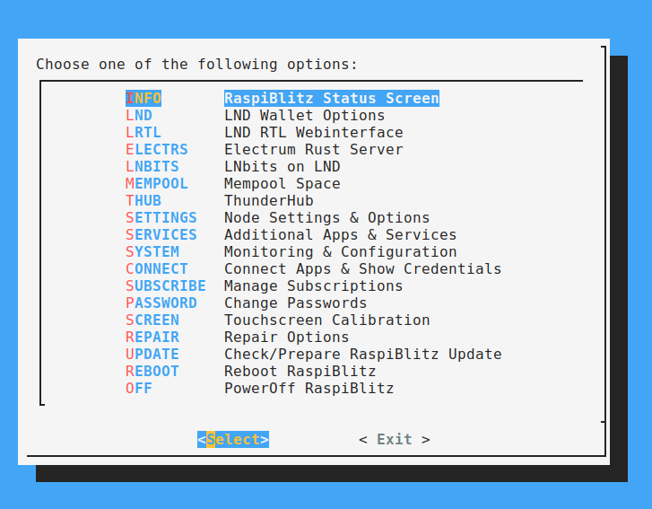

# Installation von HA in einem Docker Container auf einer Raspiblitz Node

***Disclaimer:***
Dies ist ein sehr experimentelles Projekt und ich übernehme keinerlei Verantwortung. :-)
Bitte seid euch im klaren darüber das es ggf. bei falscher Konfiguration auswirkungen auf ggf. geöffnete Lightning Kanäle haben kann.
Daher gut lesen und regelmäßiges Backup beherzigen. ;-)

## Schritt 1. root Zugriff und Docker Installation 

Um Docker zu installieren macht Ihr bitte zuerst ein Update des Betriebssystems auf eurem Raspiblitz.

```
apt-get update

apt-get upgrade
```

Dazu verbindet Ihr euch via SSH auf den Raspiblitz und werdet Root.
Wenn Ihr euch als **admin** via SSH am Raspiblitz anmeldet, kommt ihr direkt auf den Auswahldialog (siehe Abbildung) den Ihr über EXIT schließt.



Jetzt seid Ihr auf der Kommandozeile und könnt mit `sudo -s` zu root werden.

### root Zugriff
Wer sich gerne direkt via root auf dem Raspiblitz anmelden möchte kann folgendes tun:

Auf dem Raspiblitz die Datei `/etc/ssh/sshd_config` um folgenden Eintrag erweitern.

```
PermitRootLogin yes
```

Danach den **ssh** Dienst neu starten: `/etc/init.d/ssh restart`.

Nun ist eine Anmeldung mit **root** via SSH möglich.

### Installation

Nachdem Du als root auf dem system arbeiten kannst und das 
