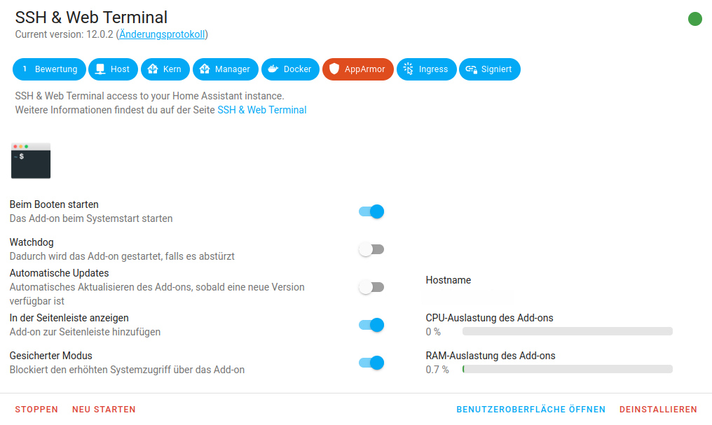

# Wie richte ich SSH in HA ein?

## Schritt 1. Installiere das Addon SSH & Web Terminal


---

## Schritt 2.
Nachdem das Addon installiert wurde, siehst Du oben den reiter ***Konfiguration***. Diesen anklicken.

Dort findest Du den Abschnitt ***ssh***.

Dort muss folgendes ausgefüllt werden:

```
username: USER
password: PASSWORD
```
Alternativ kann das Feld `authorized_keys:` gefüllt werden um eine ssh Verbindung ohne Passwort von einem anderen PC zu HA zu ermöglichen.

Danch das addon neu starten und Ihr könnt euch von außen an HA via SSH anmelden oder direkt über das Addon und die Benutzeroberfläche gehen.
